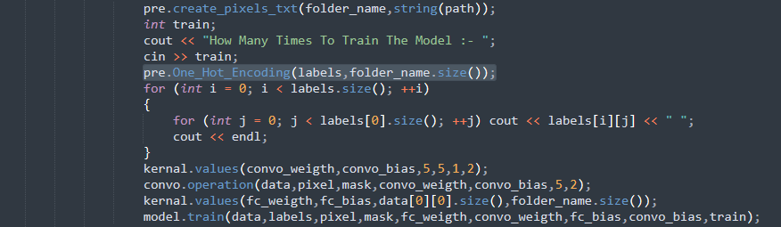
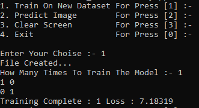

*************
Architecture
*************

==============
Preprocessing 
==============
First of all preprocessing are programme with two multiple languages but not have connected together C++ and Python. C++ are work for preprocessing to create commad to execute and create pixels forders and in that given dataset have multiple folders for multiple objects so same to same in C++ And Python also C++ create commad with dataset path and python will create pixels folder in current directory and make .txt file of multiple objects in count of limit and stores the normalized pixels in that.
Now Let's How to create pixels folder that collection of given dataset multiple object images pixels to normalized and create txt files.
**************************
Selecting Dataset

**************************

After Press Ok The Programme Will show the message that created the folder.

**************************
**************************
How It's Look After Preprocessing

**************************
Now as you can see we have created the pixels folder and cretes .txt file that have image normalized pixels.

**************************
**************************
Why 6 Line

**************************

As you can you seen the down side of my pixels folder image that are 6 line there means what? when i give path dataset in that two folders have 5 images in each. So my progamme will one poxels in one with heigth * widths  = one_line eg. 64 * 64 = 4096 without ",".

Preprocessing I have already developed separatly This Link 🔗 https://github.com/AlwaysDhruv/Image_Preprocessing
**************************
**************************
One Hot Encoding

**************************

The Given Image i have used member() of preprocess class by using pre objetc. I have give Two arguments first labels that in stores the one hot values in double dimentional vector. Labels are type of true output that are used optimiza loss and make the suitbale weigths and biases value to predict the output using gradients and decents method.

**************************
How it's look

Here you can see the 2x2 matrix are there and why it's 2x2 or how it's develop? When we are preprocessing you have watched the we have give the dataset folder to the model and in that dataset have two folders that defines two objects. so when the first folder will came out for one values with their folder name so programme will give one hot value like [1 0]. why 1 are first because there first folder are came output and when second folder will cam out so one value like that [0 1] and size one value 2 why bacause there are two objects.

[1 0] folder1
[0 1] folder2

**************************
**************************
==============
Weights Biases
==============
